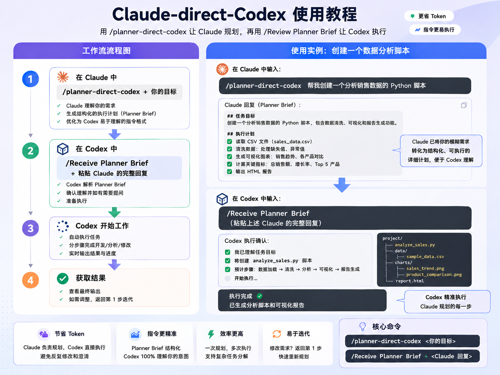

# Claude Direct Codex Skill Pair


## 教程图 / Tutorial Image



## 中文

这个仓库用扁平结构管理一组配套 skill：

- `planner-direct-codex/`: planner 端 skill，把需求整理成可以直接粘贴给 Codex 的 bounded brief。
- `receive-planner-brief/`: Codex 端 skill，读取 planner brief，执行任务，并按固定格式回报。

两个 skill 共享同一组 brief contract：

- `Goal`
- `Why`
- `Scope`
- `Out of Scope`
- `Constraints`
- `Acceptance Criteria`
- `Deliverables`
- `Validation`
- `Output Format`

Codex 端回报格式固定为：

- `Summary`
- `Files changed`
- `Validation results`
- `Risks or follow-ups`

### 安装 planner-direct-codex 到 Claude Code

```powershell
$skillDir = Join-Path $HOME ".claude\skills\planner-direct-codex"
New-Item -ItemType Directory -Force $skillDir | Out-Null
Copy-Item -Recurse -Force .\planner-direct-codex\SKILL.md, .\planner-direct-codex\references $skillDir
```

### 安装 receive-planner-brief 到 Codex

```powershell
$skillDir = Join-Path $HOME ".codex\skills\receive-planner-brief"
New-Item -ItemType Directory -Force $skillDir | Out-Null
Copy-Item -Force .\receive-planner-brief\SKILL.md $skillDir
```

### ZIP 上传

分别压缩 `planner-direct-codex/` 和 `receive-planner-brief/`。每个 ZIP 的顶层目录都应是对应 skill 目录，并包含自己的 `SKILL.md`。

## English

This repository manages a paired skill workflow with a flat top-level layout:

- `planner-direct-codex/`: planner-side skill that turns a request into one Codex-ready bounded brief.
- `receive-planner-brief/`: Codex-side skill that consumes the planner brief, executes the task, and reports back in a stable format.

The two skills share the same brief contract:

- `Goal`
- `Why`
- `Scope`
- `Out of Scope`
- `Constraints`
- `Acceptance Criteria`
- `Deliverables`
- `Validation`
- `Output Format`

The Codex-side response format is:

- `Summary`
- `Files changed`
- `Validation results`
- `Risks or follow-ups`

### Install planner-direct-codex In Claude Code

```powershell
$skillDir = Join-Path $HOME ".claude\skills\planner-direct-codex"
New-Item -ItemType Directory -Force $skillDir | Out-Null
Copy-Item -Recurse -Force .\planner-direct-codex\SKILL.md, .\planner-direct-codex\references $skillDir
```

### Install receive-planner-brief In Codex

```powershell
$skillDir = Join-Path $HOME ".codex\skills\receive-planner-brief"
New-Item -ItemType Directory -Force $skillDir | Out-Null
Copy-Item -Force .\receive-planner-brief\SKILL.md $skillDir
```

### ZIP Uploads

Zip `planner-direct-codex/` and `receive-planner-brief/` separately. Each archive should contain its corresponding top-level skill directory with its own `SKILL.md`.
